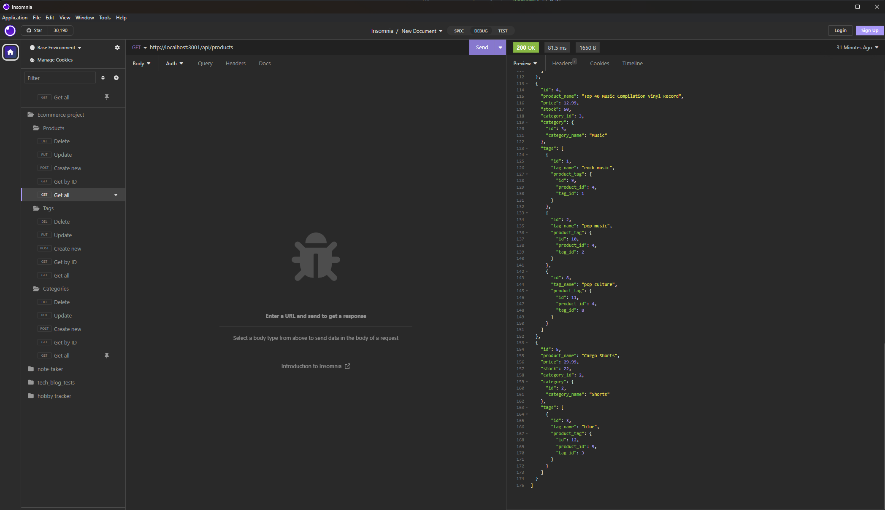
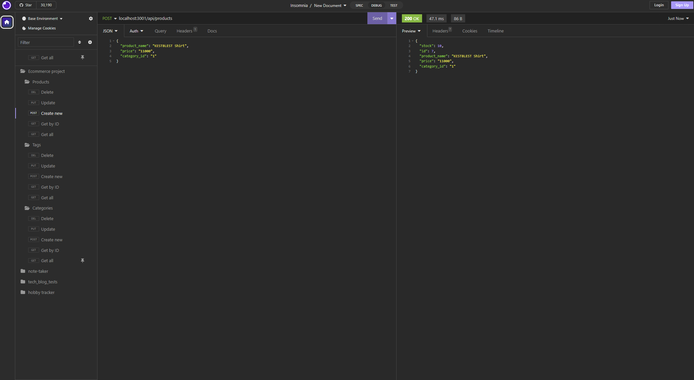

# Ecommerce_backend
The project for week 4--Building the backend for a ecommerce site: KestBlest-the Kest way is the best way.

## Table of Contents
 - [Installation](#installation)
 - [usage](#usage)
 - [License](#license)
 - [Features](#featues)
 - [Contribution Guidelines](#contributing)
 - [Questons/Contact](#questions)

## Installation
You will need:
1. MySQL2 and sequelize packages downloaded.
2. Express.js package.
3. dotenv package.
4. An application for testing API routes, such as Insomnia is reccommended.

## Usage
First you'll have to creat the database by entering the MySQL command shell and running the schema to initilize the database. Second you will exit the shell then seed the database by running the seed commmand. After this, start the application server and test routes through Insomnia.

## License
This project does not currently have a license.

## Features
This project features a SQL database that includes three tables: Categories, Products, and Tags. These feature different relationships; including: Products belonging to one Category, Category having many products, Product belonging to many tags, and finally, tags belonging to many products. In addition to this, and the miracle of MySQl database capablities, there are many little more features, being too many to list here.

## Contribution Guidelines
This is a private project for instructional purposes. Future contributions are unlikely but possible.

### Questions
For any questions, please contact me:

GitHub: [Nate's GitHub](https://github.com/imdawizard)

Email: nate.is.cool.yeah@gmail.com

## Link to Github Repo:
https://github.com/imdawizard/E-commerce_backend 

## Screenshots:

